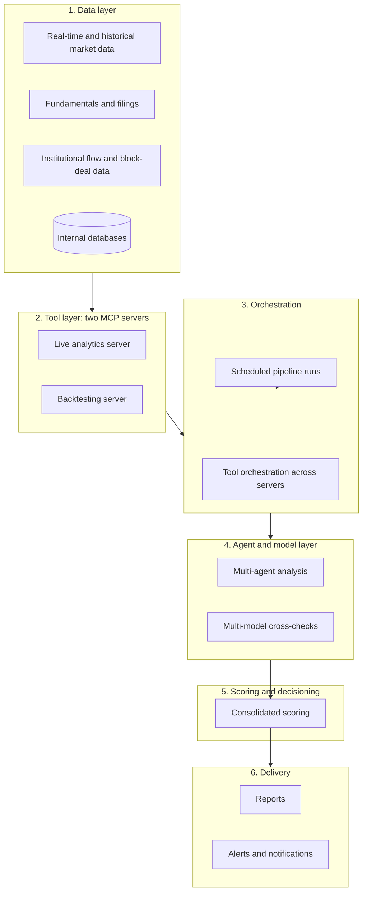

# Production AI Research and Analytics Platform

Architecture overview of a production AI and quantitative-research system for Indian equity and derivatives markets, designed and operated by one engineer at a private research firm.

**Scope of this repository.** This is an overview only. It contains no source code, prompts, data, configuration, credentials, infrastructure details, strategy or scoring logic, or client information. Everything described runs on real-time and historical market data. No synthetic data is used.

## What the system does

- Ingests real-time and historical market data, fundamentals, and institutional flow and block-deal data
- Runs multi-agent analysis across a defined universe of instruments
- Maintains derivatives analytics and portfolio risk measures
- Produces scheduled research reports and client notifications
- Exposes its analytics as tools that LLM agents can call and combine

## Architecture

### Layers

**1. Data layer.** Market data, fundamentals, institutional flow, and block-deal data come from internal databases and external sources, normalized into a consistent schema. Caching is set per data type, so slow-changing data is not refetched on every cycle.

**2. Tool layer.** Two MCP servers. The live analytics server covers pricing, derivatives measures, portfolio risk, and macro and flow signals. The backtesting server runs separately, so heavy batch workloads cannot slow down latency-sensitive tools.

**3. Orchestration.** An orchestration layer routes and combines tools across both servers and schedules recurring pipeline runs.

**4. Agent and model layer.** Specialized agents analyze each instrument in parallel from different angles. A second model independently reviews ambiguous analytics. Prompts are version-controlled, and decision-relevant steps run on pinned model versions.

**5. Scoring and decisioning.** Agent outputs are combined into one consolidated view per instrument and per portfolio. The scoring logic is not described here.

**6. Delivery.** Reports are generated from fixed templates, so the model supplies content and never controls layout. Alerts travel through a path that does not depend on the component being monitored.

## Workflow of a scheduled run

1. A scheduled run starts after the data refresh completes.
2. The data layer supplies validated inputs, and invalid inputs stop the run before any model call.
3. Agents analyze each instrument in parallel through the tool layer.
4. The scoring layer combines agent outputs into a consolidated view.
5. Portfolio state is reconciled against the previous run, so each decision is made relative to current holdings.
6. Reports are rendered and delivered. Any failure triggers an alert.

## Operations (LLMOps and MLOps)

- Prompt and model version control, with pinning for decision-relevant steps
- Per-run token and cost tracking
- Structured output validation before anything is delivered
- Scheduled production runs with health checks and fallback alerting
- Build, test, and deploy: changes are developed and tested locally, pushed to GitHub, verified by CI/CD, and deployed to AWS automatically

## Design principles

- Separate reasoning from presentation: models produce content, templates produce layout.
- Rebuild state from an append-only record instead of trusting model memory.
- Isolate heavy batch work from latency-sensitive tools.
- Alert through a path that does not depend on the component that failed.
- Cross-check ambiguous outputs with a second model.

## Stack

Python, FastAPI, PostgreSQL, AWS, Model Context Protocol (MCP), Anthropic and Google Gemini APIs, scheduled jobs, CI/CD.

## Writing

- Medium article: https://medium.com/@sagarkumar123413/24b97254677f

## Not included

Source code, prompts, data, strategy and scoring logic, model configuration, credentials, server and network topology, client details, and screenshots of internal systems.

## Author

Sagar Kumar. Shared for portfolio and discussion purposes. Not licensed for reuse.
