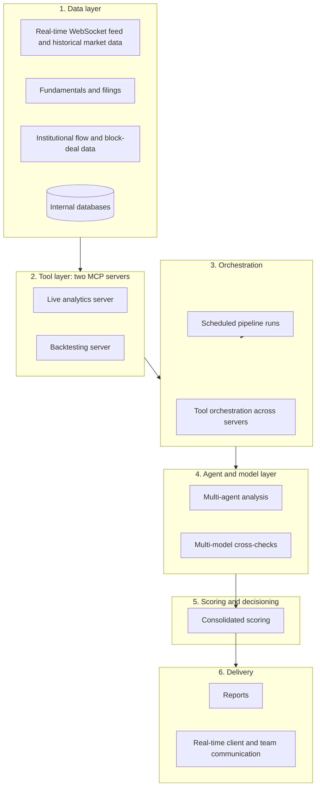

# Meridian Agent Platform

A production AI agent and tool platform for quantitative research on Indian equity and derivatives markets. Designed and operated by one engineer at a private research firm.

**Scope.** This repository is documentation only. Each branch describes one part of the platform. None of them contains source code, prompts, data, configuration, credentials, or infrastructure details. Everything described runs on real-time and historical market data. No synthetic data is used.

## What the platform can do

- Streams real-time market data over WebSocket from Angel One SmartAPI and stores it alongside historical data
- Produces a formal daily market-intelligence report and options research every weekday morning, and delivers it to clients
- Serves market, options, fundamental, macro, flow, risk, and database-management capabilities as tools that AI agents can call
- Runs historical backtests of options and equity strategies on a separate server
- Analyzes a universe of stocks with multiple specialized agents and combines the results into one scored view
- Maintains a live portfolio view, re-evaluated every cycle, with new, hold, reduce, and exit decisions
- Produces on-demand portfolio analysis reports for clients
- Sends real-time notifications to clients and the team through Slack and email
- Deploys changes through CI/CD to AWS EC2 after they pass validation

## Why it exists

Quantitative research is repetitive and time-sensitive. Manual morning research, portfolio review, and report production take hours and vary by analyst. The platform makes those steps repeatable, checked, and timely. Clients get consistent reports on schedule and real-time updates when something needs attention. Researchers get a shared set of analytics and a way to maintain portfolios without rebuilding them each cycle. Built-in checks make sure that missing data or a failed model call produces a flagged result, never a silent or invented one.

## Projects

| Branch | What it covers |
|---|---|
| [daily-market-intelligence](https://github.com/sagar54368/meridian-agent-platform/tree/daily-market-intelligence) | Scheduled multi-agent market research and options-automation pipeline |
| [mcp-tool-platform](https://github.com/sagar54368/meridian-agent-platform/tree/mcp-tool-platform) | Two MCP servers and an orchestration layer for agent-callable analytics, database operations, and client communication |
| [ai-portfolio-management](https://github.com/sagar54368/meridian-agent-platform/tree/ai-portfolio-management) | Multi-agent stock analysis, composite scoring, and live portfolio maintenance |
| [data-platform](https://github.com/sagar54368/meridian-agent-platform/tree/data-platform) | Real-time streaming, ingestion, normalization, storage, and database management |
| [llmops-mlops](https://github.com/sagar54368/meridian-agent-platform/tree/llmops-mlops) | Versioning, observability, validation, and CI/CD to AWS EC2 |
| [reporting-delivery](https://github.com/sagar54368/meridian-agent-platform/tree/reporting-delivery) | Report rendering, on-demand portfolio analysis, and real-time client communication |

The first two rows are the platform's two main projects. The rest are the supporting parts.

## Architecture

## Tech stack

- **Languages:** Python (primary), SQL, Bash
- **AI models:** Anthropic Claude (research, decisions, and portfolio analysis), Google Gemini (second-model cross-checks)
- **AI tooling:** Claude Code in headless mode, Model Context Protocol (MCP) with the official Python SDK and FastMCP, Anthropic and Google Gen AI SDKs
- **Backend:** FastAPI, Uvicorn, Server-Sent Events transport
- **Market data:** Angel One SmartAPI, including its WebSocket feed
- **Analytics:** pandas, NumPy, SciPy
- **Data:** PostgreSQL on AWS RDS, psycopg2, internal databases, external market-data and screener sources
- **Parsing and collection:** BeautifulSoup, PDF text extraction, rate-limited API clients
- **Auth and communication:** Firebase Admin SDK, Slack SDK and Bolt, Slack webhooks, email
- **Cloud and operations:** AWS EC2 and RDS, cron, process supervision with automatic restart, Git and GitHub, CI/CD deployment to AWS EC2

## How the parts connect

Market data streams in over WebSocket and historical data is fetched through the same brokerage API. Both land in internal stores managed by the data platform. The MCP tool layer reads from those stores and from approved external sources. The orchestration layer lets agents combine tools in one workflow. Agents produce structured analysis, which is scored, checked, and rendered into reports. Operations practices run across every layer: versioned prompts, pinned models for decisions, cost tracking, validation before delivery, and automated deployment.

## Writing

- Medium article: https://medium.com/@sagarkumar123413/24b97254677f

## Not included

Source code, prompts, data, strategy and scoring logic, model configuration, credentials, server and network topology, client details, and screenshots of internal systems.

## Author

Sagar Kumar. Shared for portfolio and discussion purposes. Not licensed for reuse.
