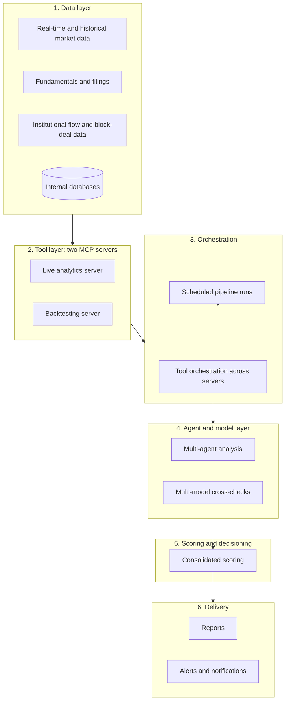

# Meridian Agent Platform

Architecture overview of a production AI agent and tool platform for quantitative research on Indian equity and derivatives markets. Designed and operated by one engineer at a private research firm.

**Scope.** This repository is documentation only. Each branch describes one part of the platform at the architecture level. None of them contains source code, prompts, data, configuration, credentials, or infrastructure details. Everything described runs on real-time and historical market data. No synthetic data is used.

## Projects

| Branch | What it covers |
|---|---|
| [daily-market-intelligence](https://github.com/sagar54368/meridian-agent-platform/tree/daily-market-intelligence) | Scheduled multi-agent market research and options-automation pipeline |
| [mcp-tool-platform](https://github.com/sagar54368/meridian-agent-platform/tree/mcp-tool-platform) | Two MCP servers and an orchestration layer for agent-callable analytics |
| [ai-portfolio-management](https://github.com/sagar54368/meridian-agent-platform/tree/ai-portfolio-management) | Multi-agent stock analysis, composite scoring, and live portfolio maintenance |
| [data-platform](https://github.com/sagar54368/meridian-agent-platform/tree/data-platform) | Ingestion, normalization, and storage for market, fundamental, flow, and news data |
| [llmops-mlops](https://github.com/sagar54368/meridian-agent-platform/tree/llmops-mlops) | Versioning, observability, validation gates, and CI/CD to AWS |
| [reporting-delivery](https://github.com/sagar54368/meridian-agent-platform/tree/reporting-delivery) | Report rendering, on-demand portfolio analysis, and client delivery |

The first two rows are the platform's two main projects. The rest are the supporting parts.

## Architecture

## How the parts connect

Market, fundamental, flow, and news data enter through the data platform and land in internal stores. The MCP tool layer reads from those stores and from approved external sources. The orchestration layer lets agents combine tools in one workflow. Agents produce structured analysis, which is scored, checked, and rendered into reports. Operations practices run across every layer: versioned prompts, pinned models for decisions, cost tracking, validation before delivery, and automated deployment.

## Writing

- Medium article: https://medium.com/@sagarkumar123413/24b97254677f

## Not included

Source code, prompts, data, strategy and scoring logic, model configuration, credentials, server and network topology, client details, and screenshots of internal systems.

## Author

Sagar Kumar. Shared for portfolio and discussion purposes. Not licensed for reuse.
